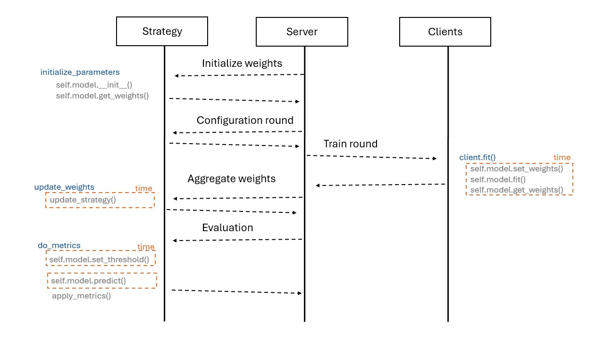

# Comparison ...

This is the official code from ....

## Datasets
The datasets that were use are:

*   **HDFS**: .....
*   **BGL**: .....

## Scripts
Current scripts in the repository:
*   **client_app.py**: start a client server.
*   **server_app.py**: start the main server.

### Example Single method:
To run the code:
- Running server:
```
python server_app.py --config config_files/hdfs.yaml --method 3-Gram --run_number 0
```
- Running client:
```
python client_app.py --config config_files/hdfs.yaml --method 3-Gram --run_number 0 --num_client 0
```

### Example Combine methods:
To run the code:
- Running server:
```
python server_app.py --config config_files/bgl.yaml --method KnowEvents LengthDetection --run_number 0
```
- Running client:
```
python client_app.py --config config_files/bgl.yaml --method KnowEvents LengthDetection --run_number 0 --num_client 0
```

## Federated learning diagram
The strategy was created following the [flower documentation](https://flower.ai/docs/framework/how-to-implement-strategies.html).
